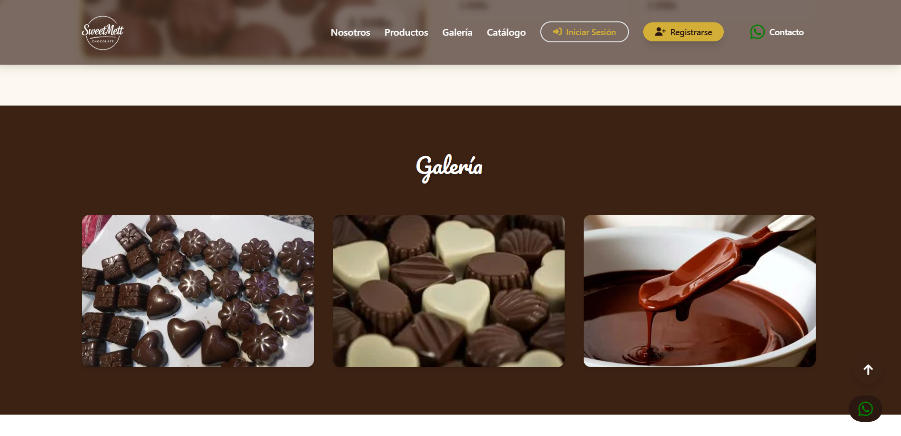
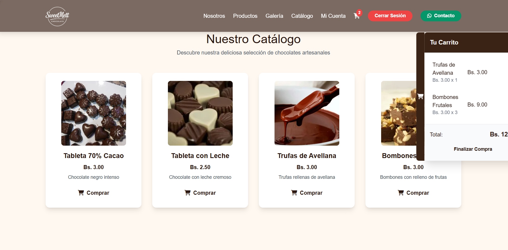
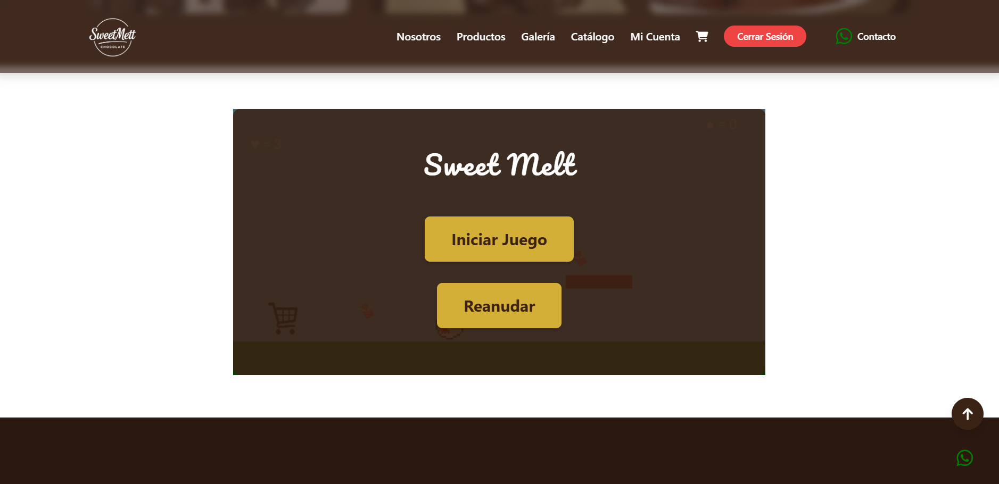
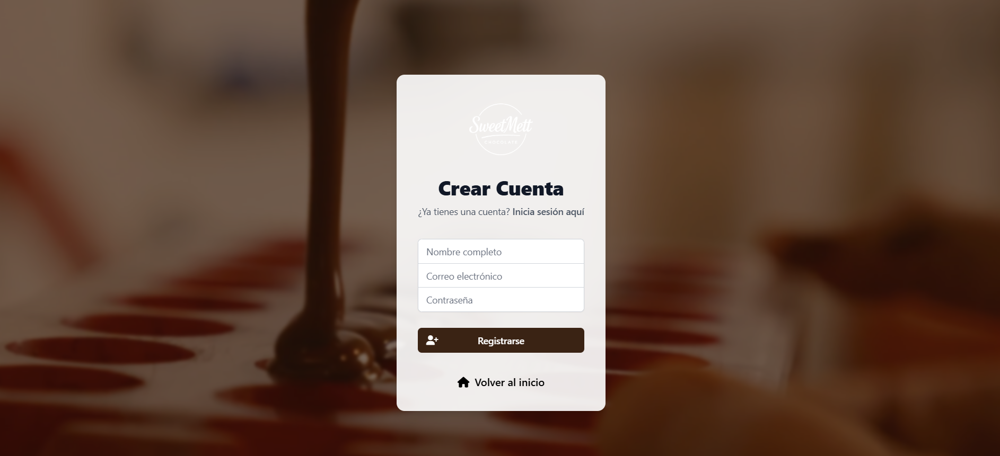
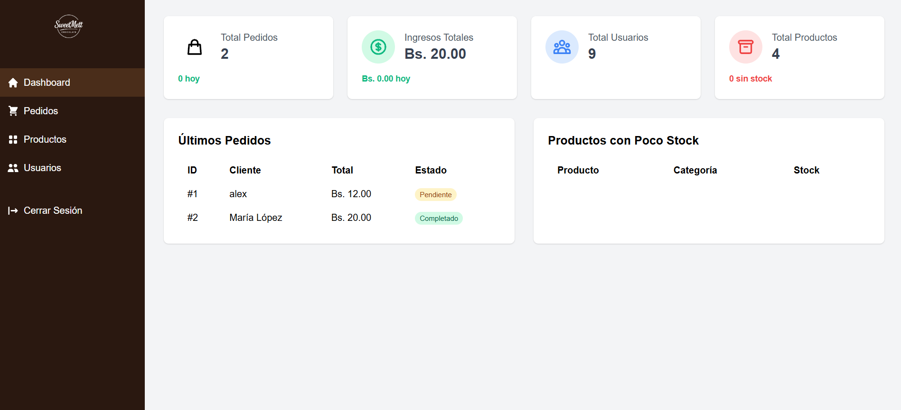

# 🍫 Sweet Mett - Web Chocolate Cliente & Admin

Bienvenido a **Sweet Mett**, una plataforma web integral para la venta y administración de chocolates artesanales, desarrollada como proyecto académico por **Alex Jhail Sanchez Rea**, estudiante de Ingeniería de Sistemas en UTEPSA.

Este sistema combina una tienda virtual moderna, un panel administrativo completo y una sección interactiva tipo videojuego, todo en un entorno responsivo y amigable.

---

## ✨ Características Destacadas

- **Registro y autenticación de usuarios** (clientes y administradores)
- **Catálogo visual de productos** con imágenes y descripciones
- **Carrito de compras** para clientes registrados
- **Panel de administración**: gestión de productos, usuarios y pedidos
- **Mini juego interactivo** en JavaScript para mejorar la experiencia del usuario
- **Galería multimedia** y animaciones modernas (AOS, smooth scroll)
- **Botón de contacto rápido por WhatsApp**
- **Diseño responsivo** para móviles y escritorio
- **Base de datos MySQL** incluida para gestión integral

---

## 🖼️ Capturas de Pantalla

### Pantalla de Inicio


### Historia


### Galería


### Catálogo


### Mini Juego


### Login


### Panel Administrador

---

## 🛠️ Tecnologías Utilizadas

- **Frontend:** HTML5, CSS3 (Tailwind CSS), JavaScript (AOS, FontAwesome)
- **Backend:** PHP 8+
- **Base de Datos:** MySQL
- **Servidor Local:** XAMPP
- **Control de versiones:** Git

---

## 📁 Estructura del Proyecto

```
WEBCHOCOLATECLIENTEADMIN/
│
├── admin/                # Panel de administración
├── assets/               # Imágenes, videos y recursos multimedia
├── cliente/              # Área privada para clientes
├── css/                  # Hojas de estilo (Tailwind, personalizados)
├── includes/             # Archivos PHP reutilizables (sesión, conexión, helpers)
├── js/                   # Scripts JS adicionales y minijuego
├── config/               # Configuración de base de datos
├── index.php             # Página principal (landing)
├── catalogo.php          # Catálogo de productos
├── login.php             # Inicio de sesión
├── registro.php          # Registro de usuarios
├── logout.php            # Cierre de sesión
├── README.md             # Este archivo
└── database.sql          # Script de base de datos
```

---

## 🚀 Instalación y Ejecución Local

1. **Clona el repositorio:**
   ```bash
   git clone https://github.com/tuusuario/WEBCHOCOLATECLIENTEADMIN.git
   ```

2. **Copia la carpeta al directorio de tu servidor local (XAMPP):**
   ```bash
   # Ejemplo en Windows
   C:\xampp\htdocs\WEBCHOCOLATECLIENTEADMIN
   ```

3. **Configura la base de datos:**
   - Crea una base de datos en MySQL (por ejemplo, `sweetmett`).
   - Importa el archivo `database.sql` usando phpMyAdmin o la terminal.

4. **Configura la conexión en `config/database.php`** con tus credenciales de MySQL.

5. **Inicia Apache y MySQL en XAMPP**.

6. **Abre tu navegador en:**
   ```
   http://localhost/WEBCHOCOLATECLIENTEADMIN
   ```

---

## 👨‍💻 Sobre el Autor

**Alex Jhail Sanchez Rea**  
Estudiante de Ingeniería de Sistemas - UTEPSA  
Apasionado por el desarrollo web, la innovación y la tecnología educativa.

---

## 📈 Mejoras Futuras

- Validaciones avanzadas y seguridad (hashing, protección contra inyecciones SQL)
- Gestión de stock y reportes
- Integración de pasarela de pagos
- Notificaciones por correo electrónico
- Refactorización a arquitectura MVC

---

## 📄 Licencia

Proyecto académico y educativo.  
Puedes modificarlo y adaptarlo para tus propios fines, citando al autor.

---

¡Gracias por visitar este dulce proyecto!  
Si te gusta, no dudes en darle una ⭐ en GitHub.

---

> _“El chocolate es felicidad que se puede comer.”_
